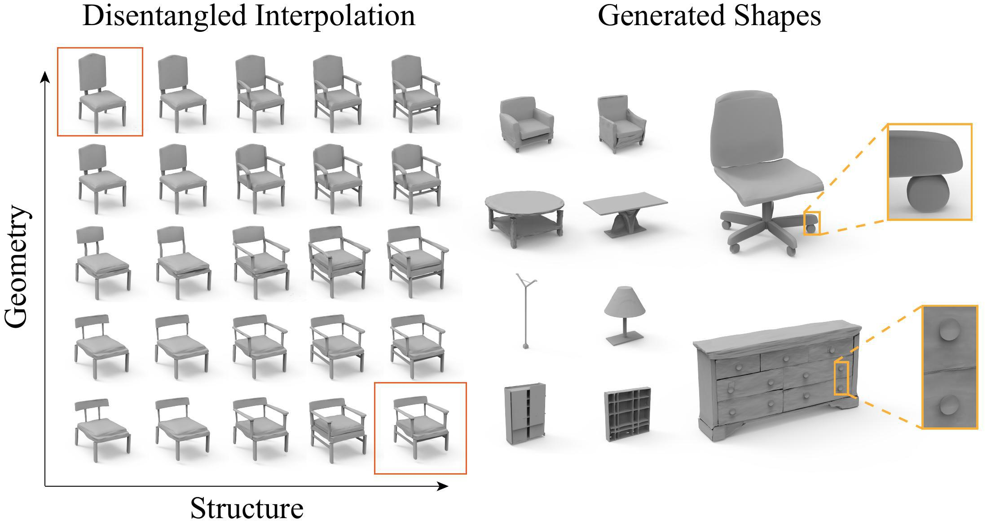

# DSG-Net: Learning Disentangled Structure and Geometry for 3D Shape Generation


**Figure 1.** Our deep generative network DSM-Net encodes 3D shapes with complex structure and fine geometry in a representation that leverages the synergy between geometry and structure, while disentangling these two aspects as much as possible. This enables novel modes of controllable generation for high-quality shapes. Left: results of disentangled interpolation. Here, the top left and bottom right chairs (highlighted with red rectangles) are the input shapes. The remaining chairs are generated automatically with our DSM-Net, where in each row, the `structure` of the shapes is interpolated while keeping the geometry unchanged, whereas in each column, the `geometry` is interpolated while retaining the structure. Right: shape generation results with complex structure and fine geometry details by our DSM-Net. We show close-up views in dashed yellow rectangles to highlight local details.

## Introduction
We introduce DSM-Net, a deep neural network that learns a disentangled structured mesh representation for 3D shapes, where two key aspects of shapes, geometry and structure, are encoded in a synergistic manner to ensure plausibility of the generated shapes, while also being disentangled as much as possible. This supports a range of novel shape generation applications with intuitive control, such as interpolation of structure (geometry) while keeping geometry (structure) unchanged. 


## About the paper

Our team: 
[Jie Yang<sup>\*</sup>](http://people.geometrylearning.com/~jieyang/),
[Kaichun Mo<sup>\*</sup>](https://cs.stanford.edu/~kaichun),
[Yu-Kun Lai](http://users.cs.cf.ac.uk/Yukun.Lai/),
[Leonidas J. Guibas](https://geometry.stanford.edu/member/guibas/)
and [Lin Gao](http://geometrylearning.com/lin/)
from 
Institute of Computing Technology, CAS and University of Chinese Academy of Sciences, Stanford University, Cardiff University.

<sup>\*</sup> equal contribution.

Provisional Accept with Major Revisions, ACM Transactions on Graphics 2021

Arxiv Version: https://arxiv.org/abs/2008.05440

Project Page: http://geometrylearning.com/dsg-net/


## About this repository

This repository provides data and code as follows.


```
    data/                   # contains data, models, results, logs
    code/                   # contains code and scripts
         # please follow `code/README.md` to run the code
    stats/                  # contains helper statistics
```

## Questions

<!-- ulimit -n 65535 -->

Please post issues for questions and more helps on this Github repo page. We encourage using Github issues instead of sending us emails since your questions may benefit others.

## License

MIT Licence


